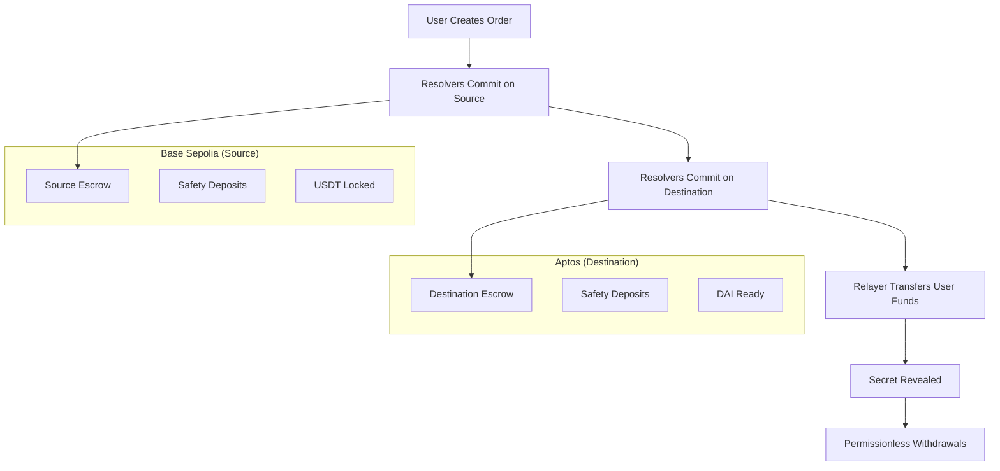

# Unite Protocol - Aptos Implementation

A comprehensive cross-chain swap protocol enabling seamless asset transfers between EVM chains (Base Sepolia, Arbitrum Sepolia) and Aptos using Hash Time-Locked Contracts (HTLCs) with partial filling support.

## 🚀 Quick Start

### Prerequisites

- Node.js 18+
- [Aptos CLI](https://aptos.dev/cli-tools/aptos-cli-tool/install-aptos-cli)
- TypeScript

### Installation

```bash
# Navigate to Aptos contracts directory
cd contracts/aptos

# Install dependencies
yarn install

# Quick setup (interactive)
yarn setup

# Or manual setup
cp .env.example .env
# Edit .env with your configuration
```

### Deploy & Test

```bash
# Deploy to devnet
yarn deploy:devnet

# Verify deployment
yarn verify-deployment

# Run unit tests
yarn test:unit

# Run cross-chain tests (requires EVM setup)
yarn test:crosschain
```

## 🔄 Cross-Chain Architecture

### Flow Overview



### Supported Chains & Tokens

| Source Chain | Destination Chain | Tokens |
|-------------|------------------|---------|
| Base Sepolia | Aptos Devnet | USDT → DAI |
| Aptos Devnet | Base Sepolia | DAI → USDT |
| Arbitrum Sepolia | Aptos Devnet | USDT → DAI |
| Aptos Devnet | Arbitrum Sepolia | DAI → USDT |

## 📁 Contract Architecture

### Move Modules

#### 1. `escrow.move` - Core HTLC Functionality
```move
// Key functions:
public fun initialize<CoinType>(account: &signer, immutables: Immutables, is_source: bool)
public fun withdraw_with_secret<CoinType>(caller: address, secret: vector<u8>, ...)
public fun cancel<CoinType>(caller: address, immutables: Immutables, ...)
```

**Features:**
- Multi-resolver partial fills
- Time-locked cancellations  
- Secret-based atomic swaps
- Proportional safety deposits
- Permissionless withdrawals with caller rewards

#### 2. `escrow_factory.move` - Escrow Deployment
```move
// Key functions:
public fun create_src_escrow_partial_for<CoinType>(resolver_addr: address, ...)
public fun create_dst_escrow_partial_for<CoinType>(resolver_addr: address, ...)
public fun transfer_user_funds<CoinType>(admin: &signer, order_hash: vector<u8>, ...)
```

**Features:**
- Deterministic escrow addresses
- Resolver participation tracking
- User fund management
- Cross-chain coordination

#### 3. `limit_order_protocol.move` - Order Management
```move
// Key functions:
public fun fill_order<MakerCoinType, TakerCoinType>(taker: &signer, order: Order, ...)
public fun cancel_order(maker: &signer, order: Order, ...)
```

**Features:**
- Dutch auction pricing
- Partial fill support
- Order validation & signatures
- Cross-chain order routing

#### 4. `resolver.move` - Resolver Interface
```move
// Key functions:
public fun deploy_src_partial<CoinType>(resolver_signer: &signer, ...)
public fun deploy_dst_partial<CoinType>(resolver_signer: &signer, ...)
public fun withdraw<CoinType>(caller: &signer, secret: vector<u8>, ...)
```

**Features:**
- Unified resolver interface
- Cross-chain escrow coordination
- Automated order fulfillment

#### 5. `test_coin.move` - Test Tokens
```move
// Coins:
struct TestUSDT has key {}  // 6 decimals
struct TestDAI has key {}   // 18 decimals

// Functions:
public fun mint_usdt(admin: &signer, recipient: address, amount: u64)
public fun mint_dai(admin: &signer, recipient: address, amount: u64)
```

## 🛠 Development Setup

### Environment Configuration

```bash
# Required for Aptos
APTOS_PRIVATE_KEY=0x1234567890abcdef1234567890abcdef1234567890abcdef1234567890abcdef
APTOS_NETWORK=devnet

# Required for cross-chain testing
PRIVATE_KEY=0x1234567890abcdef1234567890abcdef1234567890abcdef1234567890abcdef
BASE_SEPOLIA_RPC_URL=https://sepolia.base.org
ARB_SEPOLIA_RPC_URL=https://arbitrum-sepolia-rpc.publicnode.com

# Optional: Multiple resolvers for testing
RESOLVER_PRIVATE_KEY_0=0x...
RESOLVER_PRIVATE_KEY_1=0x...
RESOLVER_PRIVATE_KEY_2=0x...
```

### Commands Reference

```bash
# Setup & Installation
yarn setup                    # Interactive setup wizard
yarn install                  # Install dependencies
yarn get-address              # Show account info
yarn get-address:generate     # Generate new account

# Development
yarn build                    # Compile Move contracts
yarn clean                    # Clean build artifacts
yarn lint                     # Check code formatting
yarn lint:fix                 # Fix formatting

# Deployment
yarn deploy:devnet            # Deploy to Aptos devnet
yarn deploy:testnet           # Deploy to Aptos testnet
yarn verify-deployment        # Verify deployment

# Testing
yarn test                     # Run all tests
yarn test:unit                # Unit tests only
yarn test:crosschain          # Cross-chain integration tests
yarn test:watch               # Watch mode for development
```

## 🔄 Cross-Chain Swap Examples

### Example 1: Base Sepolia → Aptos (USDT → DAI)

```typescript
// 1. User creates order on Base Sepolia
const order = {
  maker: userAddress,
  makerAsset: "0x...USDT",
  takerAsset: "aptos::test_coin::TestDAI",
  makingAmount: parseUnits("100", 6),  // 100 USDT
  takingAmount: parseUnits("99", 18),  // 99 DAI
  srcChainId: 84532,  // Base Sepolia
  dstChainId: 3,      // Aptos Devnet
  // ... auction parameters
};

// 2. Resolvers commit on both chains
// Source (Base Sepolia)
await resolver.deploySrcCompactPartial(immutables, order, signature, ...);

// Destination (Aptos)  
await resolver.deploy_dst_partial(immutables, srcCancellationTimestamp, ...);

// 3. Secret revealed → Atomic completion
await escrow.withdraw_with_secret(secret, immutables);
```

### Example 2: Aptos → Base Sepolia (DAI → USDT)

```typescript
// 1. User creates order on Aptos
const aptosOrder = {
  maker: aptosUserAddress,
  maker_asset: "TestDAI",
  taker_asset: "0x...USDT",  // Base Sepolia USDT
  making_amount: parseUnits("100", 18),  // 100 DAI
  taking_amount: parseUnits("101", 6),   // 101 USDT
  src_chain_id: 3,      // Aptos
  dst_chain_id: 84532,  // Base Sepolia
  // ... parameters
};

// 2. Cross-chain coordination
// Similar flow but reversed chains
```

## ⚙️ Configuration

### Timelock Settings

```typescript
const timelocks = {
  srcWithdrawal: 0,           // Immediate with secret
  srcPublicWithdrawal: 900,   // 15 min public reward
  srcCancellation: 1800,      // 30 min cancellation
  srcPublicCancellation: 3600, // 1 hour public cancel
  dstWithdrawal: 0,           // Immediate with secret  
  dstPublicWithdrawal: 900,   // 15 min public reward
  dstCancellation: 2700       // 45 min dst cancellation
};
```

### Safety Deposit Configuration

- **Proportional**: `(total_safety_deposit * partial_amount) / total_amount`
- **Typical Rate**: 0.1% of order value
- **Purpose**: Prevent griefing attacks
- **Return**: Automatic after successful completion

### Caller Rewards

- **Rate**: 10% of total safety deposits
- **Eligibility**: Non-maker, non-resolver callers after public timelock
- **Purpose**: Incentivize timely execution

## 🧪 Testing

### Unit Tests

```bash
yarn test:unit

# Tests cover:
# ✅ Coin initialization and minting
# ✅ Limit order protocol functions  
# ✅ Escrow factory deployment
# ✅ Resolver initialization
# ✅ Error handling
```

### Cross-Chain Integration Tests

```bash
yarn test:crosschain

# Tests cover:
# 🔄 Base Sepolia → Aptos swap flow
# 🔄 Aptos → Base Sepolia swap flow  
# 🔄 Multi-resolver partial fills
# 🔄 Secret reveal & withdrawals
# 🔄 Safety deposit handling
```

### Manual Testing

```bash
# 1. Deploy and verify
yarn deploy:devnet
yarn verify-deployment

# 2. Fund test accounts  
yarn get-address  # Get your address
# Visit: https://aptoslabs.com/testnet-faucet

# 3. Run specific test scenarios
yarn test:crosschain --reporter=verbose
```

## 📊 Monitoring & Debugging

### Explorer Links

- **Devnet**: https://explorer.aptoslabs.com/?network=devnet
- **Testnet**: https://explorer.aptoslabs.com/?network=testnet  
- **Mainnet**: https://explorer.aptoslabs.com/

### View Functions

```typescript
// Check escrow state
const info = await aptos.view({
  payload: {
    function: `${packageAddr}::escrow::get_escrow_info`,
    typeArguments: ["TestUSDT"],
    functionArguments: [escrowAddress],
  },
});

// Check coin balances
const balance = await aptos.view({
  payload: {
    function: `${packageAddr}::test_coin::get_usdt_balance`,
    functionArguments: [userAddress],
  },
});

// Check resolver participation
const resolverInfo = await aptos.view({
  payload: {
    function: `${packageAddr}::escrow::get_resolver_info`,
    typeArguments: ["TestUSDT"],
    functionArguments: [escrowAddress, resolverAddress],
  },
});
```

### Debug Logs

```bash
# Enable debug mode
DEBUG=true yarn test:crosschain

# View transaction details
export APTOS_NETWORK=devnet
yarn get-address
# Check transactions in explorer
```

## 🚨 Security Features

### 1. **Secret Verification**
- SHA3-256 hash verification
- Prevents unauthorized access
- Atomic reveal across chains

### 2. **Timelock Protection**  
- Prevents premature cancellation
- Grace periods for execution
- Emergency recovery mechanisms

### 3. **Safety Deposits**
- Economic incentives alignment
- Griefing attack prevention
- Proportional to commitment size

### 4. **Immutable Verification**
- All parameters verified on withdrawal
- Prevents parameter manipulation
- Ensures order integrity

### 5. **Permissionless Execution**
- Prevents censorship
- Public withdrawal after timelock
- Caller reward incentives

## 🤝 Integration Guide

### For Resolvers

```typescript
// 1. Initialize resolver
await resolver.initialize(
  ownerSigner,
  factoryAddress,
  protocolAddress
);

// 2. Monitor orders
const orders = await getNewOrders();

// 3. Commit to fulfill orders
for (const order of orders) {
  if (canFulfill(order)) {
    await commitToOrder(order, partialAmount);
  }
}

// 4. Handle withdrawals
await monitorForSecretReveal();
```

### For Frontend Integration

```typescript
// 1. Create order interface
const order = await createOrderFromUI(userInputs);

// 2. Sign order
const signature = await signOrder(order, userWallet);

// 3. Submit to resolvers
await broadcastOrder(order, signature);

// 4. Monitor execution
await trackOrderProgress(orderHash);
```

### For Relayers

```typescript
// 1. Monitor order fulfillment
const filledOrders = await getFilledOrders();

// 2. Transfer user funds when ready
for (const order of filledOrders) {
  if (isFullyCommitted(order)) {
    await transferUserFunds(order);
  }
}

// 3. Monitor for completion
await handleSecretReveal(orderHash, secret);
```

## 📋 Deployment Addresses

Current deployments are stored in `deployments.json`:

```json
{
  "aptos": {
    "devnet": {
      "packageAddress": "0x...",
      "testUSDT": "0x...::test_coin::TestUSDT",
      "testDAI": "0x...::test_coin::TestDAI"
    }
  }
}
```

Update after deployment:
```bash
yarn deploy:devnet  # Updates deployments.json automatically
```

## 🔧 Troubleshooting

### Common Issues

**1. Compilation Errors**
```bash
# Clear build cache
yarn clean
yarn build

# Check Move.toml address
# Ensure aptos_addr matches your account
```

**2. Deployment Failures**
```bash
# Check account balance
yarn get-address

# Fund account if needed
aptos account fund-with-faucet --account YOUR_ADDRESS

# Retry deployment
yarn deploy:devnet
```

**3. Test Failures**
```bash
# Check environment setup
cat .env

# Verify deployments
yarn verify-deployment

# Run tests individually
yarn test:unit
yarn test:crosschain
```

**4. Cross-Chain Issues**
```bash
# Verify EVM setup
echo $PRIVATE_KEY
echo $BASE_SEPOLIA_RPC_URL

# Check EVM deployments
ls ../evm-partial/deployments.json

# Test EVM contracts separately
cd ../evm-partial && yarn test
```

### Getting Help

- **Documentation**: Check inline code comments
- **Issues**: GitHub Issues
- **Discord**: Unite Protocol Discord  
- **Email**: dev@uniteprotocol.io

## 🚀 Production Checklist

### Before Mainnet

- [ ] All tests passing on devnet/testnet
- [ ] Security audit completed
- [ ] Timelock parameters reviewed
- [ ] Safety deposit rates optimized
- [ ] Frontend integration tested
- [ ] Resolver network established
- [ ] Emergency procedures documented

### Deployment Steps

1. **Testnet Deployment**
   ```bash
   APTOS_NETWORK=testnet yarn deploy
   yarn verify-deployment
   yarn test:crosschain
   ```

2. **Mainnet Deployment**
   ```bash
   APTOS_NETWORK=mainnet yarn deploy
   yarn verify-deployment
   # Extensive testing with small amounts
   ```

3. **Post-Deployment**
   - Update frontend configurations
   - Notify resolver network
   - Monitor initial transactions
   - Update documentation

## 📄 License

MIT License - see LICENSE file for details.

## 🆘 Support

- **Documentation**: [Aptos Move Book](https://move-language.github.io/move/)
- **Aptos Discord**: https://discord.gg/aptosnetwork
- **Unite Protocol**: https://unite.dev/
- **Aptos Developer Portal**: https://aptos.dev/

---

Built with ❤️ for the future of cross-chain DeFi. Join us in creating a unified liquidity layer across all blockchains!